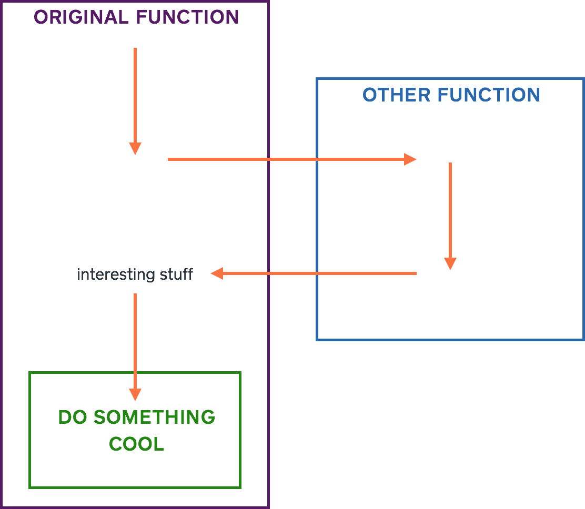
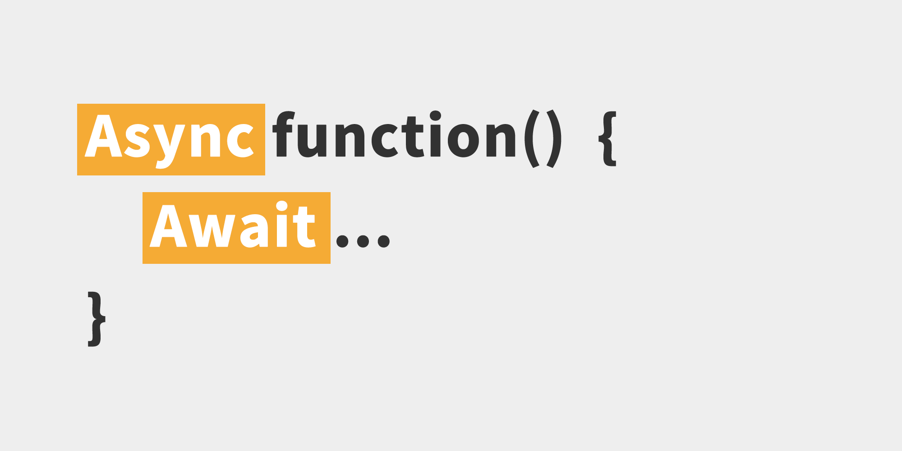

# 	JavaScript Intensiv: Sprache, Tools, Testing, Build

# 1. Intro to Javascript
----

## Javascript
### What is JavaScript
> * High level, interpreted programming language
> * Multi-paradigm ( functional style, OOP style)
> * Runs on Browser and Server (Node.js)
 
### why JavaScript
>  1. Web applications (Angular, React, Vue, Web components..)
>  2. Server side microservices / applications (Express, Nest, Sails) On NodeJS 
>  3. Mobile Apps (React Native, NativeScript, Ionic)
>  4. Desktop Apps ( Electron JS)


### Basic Syntax 
```javascript
console.log('Hello World!');
var variable = 33;
let userName = 'testUser';
const finalValue = "/api/someurl";
```

### Data Types
> Number – String - Boolean - Object - Arrays - Function - Undefined - null

#### Number
```javascript
let age = 23;
5 === 5.0  // true
Number('10')  // returns the number 10
Number('15') === 15  // true
```
#### String
```javascript
const doubleQuoted = "A string value";
const singleQuoted = 'A string value';
const backticked = `A string value`;
```
#### Boolean
```javascript
const falsy = false;
const truthy = true;
const what = 4 === 5; // false for sure -_-
```
#### Object Literal
```javascript
const student1 = {
    name: 'John',
    grade: 75,
    passed: true
};
```
#### Arrays 
In JavaScript, an array is an ordered list of values.
```javascript
const myList = ['john', 'jim', 'anna', 'max'];
```


### Control Flow
> Equality - If, else - For Loops - While loops - Switch case

----

### Objects, Arrays, Functions
> Built-in Object functions - Built-in Array functions

----

### OOP Programming
> Classes - Inheritance - This

----

### ES6 Syntax
> * Arrow syntax
> * Function arguments default value
> * Spread operator
> * Destructing objects
> * interpolations
> * Import , export

----

### Async Code
> Callbacks for handling async - Promise - Async & await


---
#### Promises
> A promise is an object that may produce a single value some time in the future : either a **resolved value**, or a reason that it's not resolved (**rejected value**)


```javascript
const myPromise = new Promise((resolve, reject) => {
  //do something that results in a success case
  if ('everything is alright') {
      resolve('Hi I promised and I fulfilled');
  }
  //do reject the promise, in case something goes wrong
  if ('I am having a bad day') {
      reject('sorry, I got a bad day :(');
  }
});

// usage
myPromise.then((val) => console.log(val)).catch((err) => console.log(err));

```
#### Async / Await
>  The async and await keywords enable asynchronous, promise-based behavior to be written in a cleaner style, avoiding the need to explicitly configure promise chains.



```javascript
async function () {
  const response = await doSomethingThatTakeTime(); // promise
  return response;
};
```
